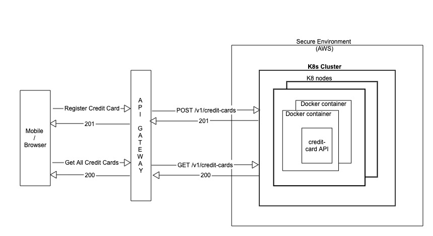
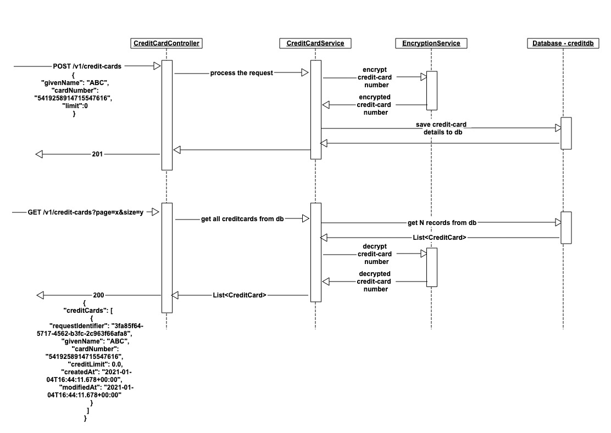

= Overview

Register Credit card micro-service is responsible for registering a credit card along with user information.
The attributes for registering a credit card are given below:

* Givenname - Name of the user credit card is registered to
* CardNumber - The card number for credit card upto 19 digits
* Limit - The credit limit associated with the credit card.
Default is 0.

Microservice takes care of two operations:

. Register Credit card: *POST /v1/credit-cards*
. Get All Credit Cards: *GET /v1/credit-cards?page=0&size=5*

== POST /v1/credit-cards

In order to maintain idempotency for POST endpoint, the service uses a header Idempotency-Key which is UUID type.
If Idempotency-Key is same, the Register endpoint will return 201 without any processing.
If Idempotency key is unique, the service will follow below steps:

* Validate Input -
** Validate CardNumber as per Luhn10 algorithm.
** Limit should be minimum 0.00 i.e. no negative values.
* Encrypt cardNumber using AES symmetric encryption.
* Save the data in Db creditdb.
* Validate cardNumber is unique using unique key in db so that same card cannot be registered to two users.

To see error codes and responses, please refer swagger.

== GET /v1/credit-cards?page=0&size=5

The API lists all credit card information in descending order of modifiedDate.
Since credit data can contain million of records, the service needs a page number and pageSize so that the response contains limited data at a time.
If the requested page does not contain any data, service will respond with empty list.
The service process the request as follows:

* Read N data based on page Number and page Size N from db.
By default, pageNumber is 0 and page size is 10.
* Decrypt card number using AES symmetric decryption.
* N cards are returned in decreasing order of modified Date.

== AES Encryption

Service uses symmetric encryption via AES from Java crypto module to encrypt/decrypt the card Number.
Symmetric encryption makes use of a single key in order to encrypt and decrypt a String.
The key in question can be added as `kubernetes sealed secret` in order to maintain security of key.

== Technologies Used

* Spring Boot - Microservice development
* In memory H2 - Database
* Spring Actuators - Enabled health endpoint.
It can be enhanced further to use prometheus reporting.
* Jacoco - to view Code coverage
* Lombok
* Flyway - for Database script migration
* Docker file to create Docker containers
* Kubernetes - container orchestration
* Asciidoctor - Documentation

== Database Model

.credit_card_details
|===
|Column Name | Datatype | Null / Not Null | Constraint

|request_identifier
|UUID
|
|Primary Key

|card_number
|VARCHAR(50)
|Not Null
|Unique Key

|given_name
|VARCHAR(50)
|Not Null
|

|credit_limit
|Decimal
|Not Null
|

|created_at
|Timestamp
|Not Null
|

|modified_at
|Timestamp
|Not Null
|

|===

== Actuator endpoints

* http://localhost:9000/actuator/health[/health]
* http://localhost:9000/actuator/info[/info]

== HLD

== LLD

